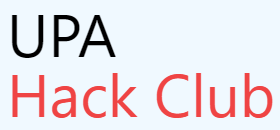

This is the official code for UPA Hack Club's Website. https://upahack.club

[![Contributors][contributors-shield]][https://github.com/UPAHackClub/ClubSite/graphs/contributors]
[![Forks][forks-shield]][https://github.com/UPAHackClub/ClubSite/network/members]
[![Stargazers][stars-shield]][https://github.com/UPAHackClub/ClubSite/stargazers]
[![Issues][issues-shield]][https://github.com/UPAHackClub/ClubSite/issues]
[![MIT License][license-shield]][https://github.com/UPAHackClub/ClubSite/blob/master/LICENSE]


<!-- PROJECT LOGO -->
<br />
<p align="center">
  <a href="https://github.com/UPAHackClub/ClubSite">
    
  </a>

  <h3 align="center">UPA Hack Club's Website</h3>

  <p align="center">
    The official website for the University Preparatory Academy Hack Club.
    <br />
    <a href="https://github.com/UPAHackClub/ClubSite"><strong>Explore the docs »</strong></a>
    <br />
    <br />
    <a href="https://upahack.club">View Demo</a>
    ·
    <a href="https://github.com/UPAHackClub/ClubSite/issues">Report Bug</a>
    ·
    <a href="https://github.com/UPAHackClub/ClubSite/issues">Request Feature</a>
  </p>
</p>


<!-- TABLE OF CONTENTS -->
<details open="open">
  <summary><h2 style="display: inline-block">Table of Contents</h2></summary>
  <ol>
    <li>
      <a href="#about-the-project">About The Project</a>
      <ul>
        <li><a href="#built-with">Built With</a></li>
      </ul>
    </li>
    <li>
      <a href="#getting-started">Getting Started</a>
      <ul>
        <li><a href="#prerequisites">Prerequisites</a></li>
        <li><a href="#installation">Installation</a></li>
      </ul>
    </li>
    <li><a href="#usage">Usage</a></li>
    <li><a href="#roadmap">Roadmap</a></li>
    <li><a href="#contributing">Contributing</a></li>
    <li><a href="#license">License</a></li>
    <li><a href="#contact">Contact</a></li>
    <li><a href="#acknowledgements">Acknowledgements</a></li>
  </ol>
</details>


<!-- ABOUT THE PROJECT -->
## About The Project

[![The Website][product-screenshot]](https://upahack.club)


### Built With

* [TailWindCSS](https://tailwindcss.com/)
* [npm](https://www.npmjs.com/)


<!-- GETTING STARTED -->
## Getting Started

To get a local copy up and running follow these simple steps.

### Prerequisites

How to 
* npm
  ```sh
  npm install -D tailwindcss@latest postcss@latest autoprefixer@latest
  ```

### Installation

1. Clone the repo
   ```sh
   git clone https://github.com/UPAHackClub/ClubSite.git
   ```
2. Install NPM packages
   ```sh
   npm install
   ```
3. Build the CSS
   ```sh
   npm run build-css
   ```


<!-- ROADMAP -->
## Roadmap

See the [open issues](https://github.com/UPAHackClub/ClubSite/issues) for a list of proposed features (and known issues).


<!-- CONTRIBUTING -->
## Contributing

Contributions are what make the open source community such an amazing place to be learn, inspire, and create. Any contributions you make are **greatly appreciated**.

1. Fork the Project
2. Create your Feature Branch (`git checkout -b feature/AmazingFeature`)
3. Commit your Changes (`git commit -m 'Add some AmazingFeature'`)
4. Push to the Branch (`git push origin feature/AmazingFeature`)
5. Open a Pull Request


<!-- LICENSE -->
## License

Distributed under the AGPVL3 License. See `LICENSE` for more information.


<!-- CONTACT -->
## Contact

Kai Devrim - [hackclub@devrim.tech](mailto:hackclub@devrim.tech) - email

File an Issue: [ClubSite/issues](https://github.com/UPAHackClub/ClubSite/issues)


<!-- ACKNOWLEDGEMENTS -->
## Acknowledgements

* [TailWindCSS](https://tailwindcss.com/)
* [npm](https://www.npmjs.com)
* [sohamb117](https://github.com/sohamb117)


<!-- MARKDOWN LINKS & IMAGES -->
<!-- https://www.markdownguide.org/basic-syntax/#reference-style-links -->
[contributors-shield]: https://img.shields.io/github/contributors/UPAHackClub/ClubSite.svg?style=for-the-badge
[contributors-url]: https://github.com/UPAHackClub/ClubSite/graphs/contributors
[forks-shield]: https://img.shields.io/github/forks/UPAHackClub/ClubSite.svg?style=for-the-badge
[forks-url]: https://github.com/UPAHackClub/ClubSite/network/members
[stars-shield]: https://img.shields.io/github/stars/UPAHackClub/ClubSite.svg?style=for-the-badge
[stars-url]: https://github.com/UPAHackClub/ClubSite/stargazers
[issues-shield]: https://img.shields.io/github/issues/UPAHackClub/ClubSite.svg?style=for-the-badge
[issues-url]: https://github.com/UPAHackClub/ClubSite/issues
[license-shield]: https://img.shields.io/github/license/UPAHackClub/ClubSite.svg?style=for-the-badge
[license-url]: https://github.com/UPAHackClub/ClubSite/blob/master/LICENSE.txt
